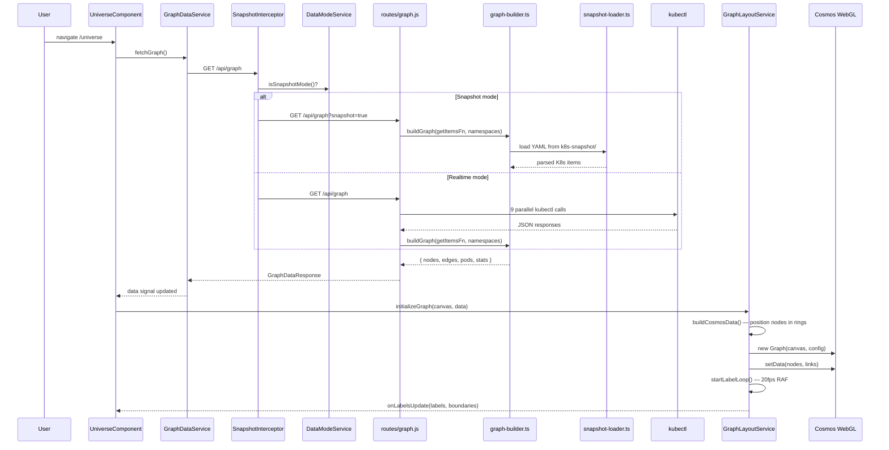
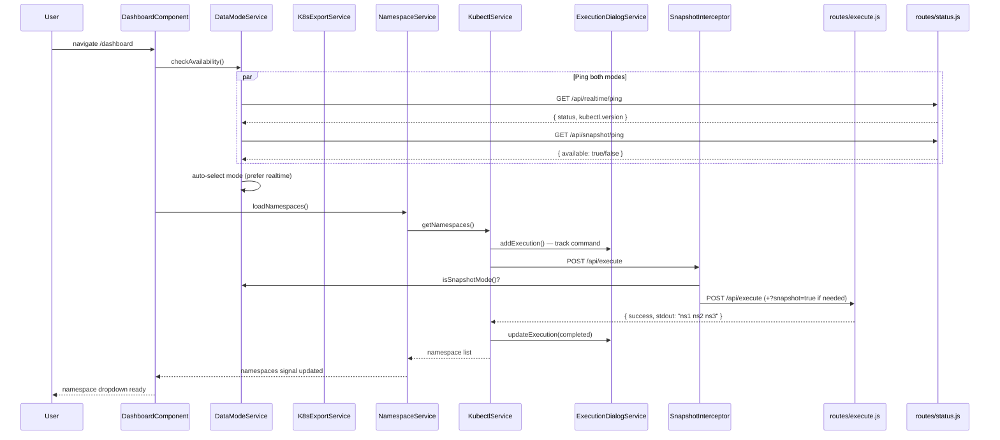
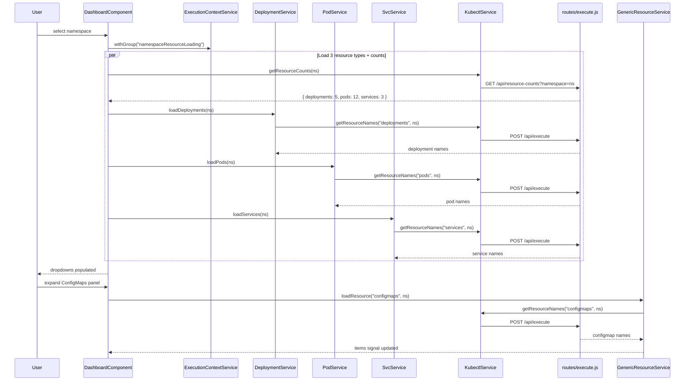
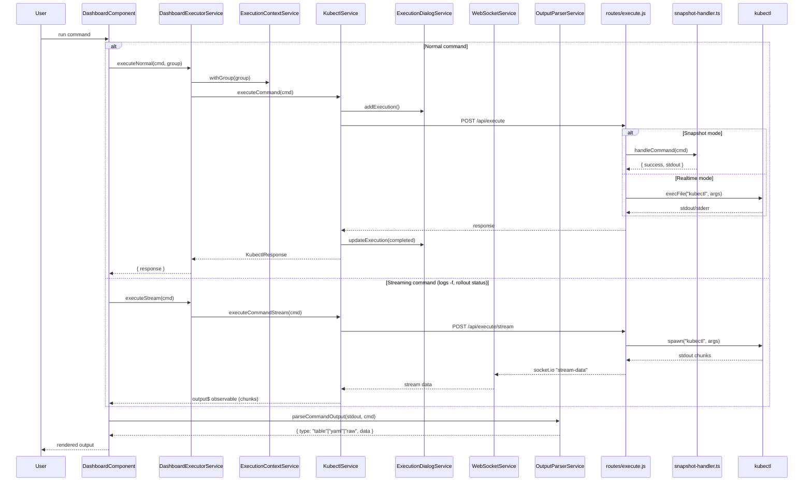

# Service Interactions

User opens a page. What happens next?

---

## Graph: Page Load

The user hits `/universe`. Three things fire. One HTTP call. One WebGL canvas. Done.

6 services touched. 1 HTTP call. Graph renders in one shot.

---

## Terminal: Page Load

The user hits `/dashboard`. Two checks fire in parallel. Then namespaces load. Nothing else until the user picks one.

3 HTTP calls. Dashboard waits for user input.

---

## Terminal: Namespace Selected

The user picks a namespace. Three resource fetches fire in parallel. Generic resources wait until expanded.

4 parallel HTTP calls on namespace select. Generic resources load on demand.

---

## Terminal: Command Execution

The user runs a command. Two paths: normal (single response) or streaming (long-running).

---

## Service Responsibilities

Each service does one thing.

### Graph feature

| Service | One-line job |
|---------|-------------|
| **GraphDataService** | Fetches `/api/graph`, caches response in signals |
| **GraphLayoutService** | Positions nodes in rings, drives Cosmos WebGL, tracks labels at 20fps |

### Terminal feature

| Service | One-line job |
|---------|-------------|
| **DashboardExecutorService** | Wraps command execution with context group and cancellation |
| **KubectlService** | Sends commands to backend, tracks each in ExecutionDialog |
| **ExecutionContextService** | LIFO stack — tags commands with a group name for batch cancellation |
| **ExecutionDialogService** | Tracks in-flight commands, shows progress, auto-hides on completion |
| **WebSocketService** | Socket.io client — routes stream chunks by streamId |
| **OutputParserService** | Detects output type (table, YAML, raw, events) from stdout |
| **TemplateService** | Generates kubectl command templates per resource type |
| **UiStateService** | Tracks which output sections are expanded/collapsed |
| **NamespaceService** | Loads and holds the namespace list |
| **DeploymentService** | Loads deployments, fetches status JSON, streams rollout status |
| **PodService** | Loads pod names for a namespace |
| **SvcService** | Loads service names for a namespace |
| **GenericResourceService** | Lazy-loads any other resource type on demand |
| **RolloutService** | Builds and executes rollout commands (restart, undo, set image) |
| **RolloutStateService** | Coordinates rollout actions — executes, waits 1s, refreshes status |
| **EcrService** | Fetches ECR image tags for deployment upgrades |

### Shared

| Service | One-line job |
|---------|-------------|
| **DataModeService** | Decides realtime vs snapshot — pings both, auto-selects |
| **K8sExportService** | Controls export lifecycle — start, pause, poll progress every 1s |
| **SnapshotInterceptor** | Adds `?snapshot=true` to every `/api/` request when in snapshot mode |
| **snapshot-loader.ts** | Reads YAML from `k8s-snapshot/`, caches in memory, blocks only on first load |
| **routes/status.js** | Two endpoints — `/api/realtime/ping` and `/api/snapshot/ping` |
